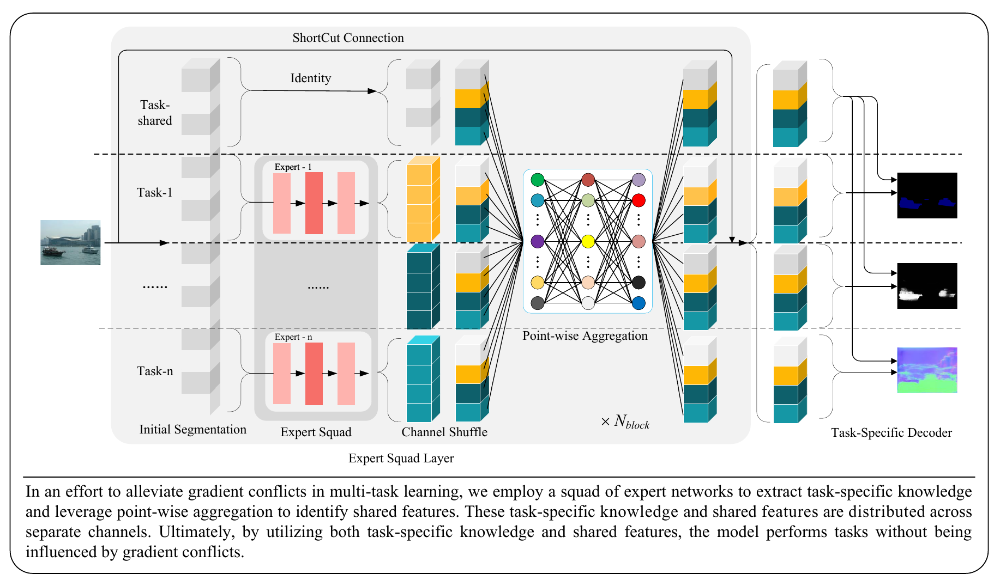

# [Mitigating gradient conflicts via expert squads in multi-task learning](https://www.sciencedirect.com/science/article/pii/S0925231224016035)

This code repository is heavily based on [Multi-Task-Learning-PyTorch](https://github.com/SimonVandenhende/Multi-Task-Learning-PyTorch) repository.


## Introduction

The foundation of multi-task learning lies in the collaboration and interaction among tasks. However, in numerous real-world scenarios, certain tasks usually necessitate distinct, specialized knowledge. The mixing of these different task-specific knowledge often results in gradient conflicts during the optimization process, posing a significant challenge in the design of effective multi-task learning systems. This study proposes a straightforward yet effective multi-task learning framework that employs groups of expert networks to decouple the learning of task-specific knowledge and mitigate such gradient conflicts. Specifically, this approach partitions the feature channels into task-specific and shared components. The task-specific subsets are processed by dedicated experts to distill specialized knowledge. The shared features are captured by a point-wise aggregation layer from the whole outputs of all experts, demonstrating superior performance in capturing inter-task interactions. By considering both task-specific knowledge and shared features, the proposed approach exhibits superior performance in multi-task learning. Extensive experiments conducted on the PASCAL-Context and NYUD-v2 datasets have demonstrated the superiority of the proposed approach compared to other state-of-the-art methods. Furthermore, a benchmark dataset for multi-task learning in underwater scenarios has been developed, encompassing object detection and underwater image enhancement tasks. Comprehensive experiments on this dataset consistently validate the effectiveness of the proposed multi-task learning strategy.



## Usage

### Setup

The following files need to be adapted in order to run the code on your own machine:

- Change the file paths to the datasets in `utils/mypath.py`, e.g. `/path/to/pascal/`.
- Specify the output directory in `configs/your_env.yml`. All results will be stored under this directory.

### Training

The configuration files to train the model can be found in the `configs/` directory. The model can be trained by running the following command:

```shell
python main.py --config_env configs/env.yml --config_exp configs/$DATASET/$MODEL.yml
```


## Citation

If you find this project useful in your research, please consider cite:

```
@article{chen2025mitigating,
  title={Mitigating gradient conflicts via expert squads in multi-task learning},
  author={Chen, Jie and Er, Meng Joo},
  journal={Neurocomputing},
  volume={614},
  pages={128832},
  year={2025},
  publisher={Elsevier}
}
```
